# Parte II: Caso DataCorp Analytics

## Actividad 1: Diseño de Entornos Aislados

### 1.1. Tabla definida de entornos:

| Entorno | Propósito | Acceso | Datos | Infraestructura | Control de código |
|---|---|---|---|---|---|
| DEV | Experimentación: se pueden hacer todo tipo de pruebas con diferentes variables, algoritmos y transformaciones para los modelos predictivos de retail sin afectar a nadie. | Todo el equipo de desarrollo (ingenieros y científicos de datos); cada uno tiene su propio entorno. | Muestras pequeñas de ventas anonimizadas y datos sintéticos de clientes. No se usan datos de producción. | Instancias de cómputo pequeñas por persona y un bucket de almacenamiento de desarrollo. | Ramas `feature/*` en Git con commits en ciclos cortos. |
| QA | Simular producción lo más fielmente posible para detectar errores antes de que lleguen a los clientes. | Equipo de QA y auditores, sin despliegues manuales (solo el pipeline despliega). | Snapshot periódico de producción con la PII de clientes anonimizada o seudonimizada. | Espejo de producción: mismos módulos de Terraform y especificaciones, a menor escala. | Rama `main` en Git; cada pull request pasa por revisión. |
| PROD | Servir los pronósticos de ventas, las APIs y los dashboards a los clientes retail de DataCorp. | Únicamente el pipeline de CD y el equipo de monitoreo. El equipo de desarrollo no tiene acceso. | Datos reales y operacionales de las transacciones de los clientes. | Base de datos de alta disponibilidad, con monitoreo, alertas y respaldos automáticos. | Versiones etiquetadas desplegadas desde `main`. Cualquier cambio requiere un nuevo despliegue. |

### 1.2. Tabla definida de entornos:
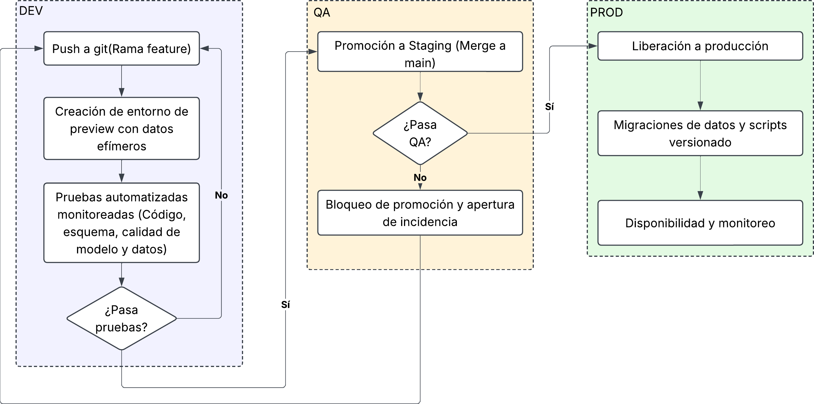

### 1.3 Simulación de escenario de error:

Supongamos que un científico de datos mejora un modelo que pronostica ventas agregando una variable que tiene en cuenta la estacionalidad. El cambio pasa las pruebas en DEV, aprobando pull request y promoviendo a QA. Cuando el modelo se entrena con el snapshot de producción, el modelo obtiene un MAPE de 18%, mientras que el modelo actual en producción tiene 12% y un umbral máximo de 15%, indican que el modelo se equivoca en el pronóstico más en producción.

Protocolo de actuación:

1. Detectar mediante las etapas de Train & Validate, se compara el MAPE contra el umbral y contra el modelo en producción, por lo que si no cumple, el job termina como error.
Herramientas: GitHub Actions, MLflow.
2. Bloquear el pipeline si la versión no funciona ni mejora.
Herramientas: Protección de cada rama y entornos de git.
3. Tener notificaciones de alerta al equipo con el enlace de cuando las métricas y commit generan un error.
Herramientas: Slack o correo.
4. Registrar incidencia de métricas, con la versión de los datos, commit e hiperparámetros utilizados.
Herramientas: GitHub Issues, y MLFlow.
5. Diagnosticar reproduce el entrenamiento en DEV manteniendo versiones de código y datos para encontrar la causa: data drift, sobreajuste o error en la distribución de las variables.
Herramientas: DVC y MLflow.
6. Corregir sobre rama con error generando nuevo commit y pull request
Herramientas: Git.

Validaciones:

1. Evaluación del desempeño del modelo con MAPE menor o igual a 15% y no mayor que el desplegado.
2. Verificación de datos de entrada con esquema correcto, no nulos y valores dentro de rangos.
3. Detección de data drift, es decir, distribución de entrenamiento de conjunto de datos, similar a conjunto de pruebas.
4. API responde en menos de 300ms con volumen proporcionado con QA.
5. Aprobación explícita de líder técnico.

## Actividad 2: Implementación de MDM

### 2.1. Entidades maestras

1. Cliente:
- Atributos clave: id o llave del cliente, tipo y número de documento, nombre completo, correo, ciudad, etc.
- Fuentes de datos: Sistemas de las tiendas, e-commerce, programas de fidelización.
- Reglas de calidad: Documento único y obligatorio, correos con formato válidos sin duplicados y consentimientos diligenciados.
- Responsable: Director CRM.

2. Producto:
- Atributos clave: id o llave del producto, nombre, categoría, marca, precio, stock, etc.
- Fuentes de datos: ERP, sistemas de inventarios, catálogos de e-commerce, fichas de proveedores.
- Reglas de calidad: Elemento único dentro un catálogo verificado y que sea un producto activo.
- Responsable: Gerente de categorías.

3. Proveedor:
- Atributos clave: id o llave del proveedor, NIT, razón social, contacto, correo, condiciones de pago, tiempo de entrega, etc.
- Fuentes de datos:  contratos, portal de proveedores.
- Reglas de calidad:NIT único y válido, razón social estandarizada y correo con formato válido.
- Responsable: Gerente de Compras.

4. Ubicación:
- Atributos clave: id o llave de la ubicación, código de tienda, tipo (tienda, bodega o centro de distribución), dirección, ciudad, región, etc.
- Fuentes de datos: sistema de operaciones, registros de aperturas y cierres de tiendas.
- Reglas de calidad: código de tienda único, ciudad según la codificación oficial (DANE), no tener en cuenta ubicaciones inactivas.
- Responsable: Gerente de Operaciones.

5. Finanzas:
- Atributos clave: centro de costo, moneda, tasa de cambio, etc.
- Fuentes de datos: tasas oficiales como la del banco de la república.
- Reglas de calidad: cada venta asociada a un centro de costo válido, moneda en formato estándar.
- Responsable: Director financiero.

### 2.2. Entidades maestras
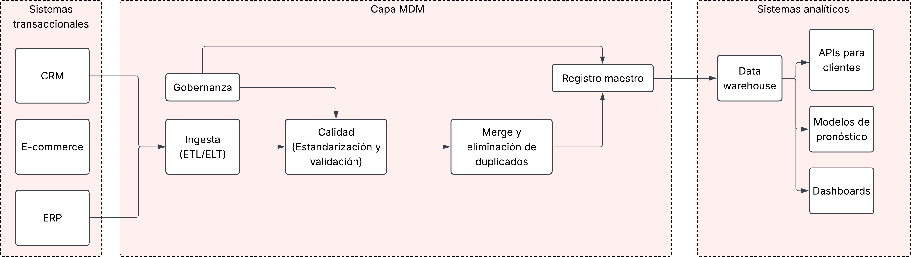

### 2.3. Políticas de gobernanza

1. Definición de cliente activo: Un cliente es activo si realizó al menos una compra en los últimos 6 meses en cualquier canal (tiendas o e-commerce). Asimismo, su fecha de corte es el último día de cada mes y las interacciones sin compra no lo convierten en un cliente en activo.

2. Reglas de limpieza y duplicación: Para la limpieza, los documento se guarda sin puntos ni espacios. Por otro lado, los nombres se estandarizan en mayúscula inicial y sin espacios dobles. En el caso de los registros sin documento o sin consentimiento diligenciado se rechazan y se reportan a la fuente. Para la detección de duplicados: dos registros son el mismo cliente si tienen el mismo tipo y número de documento. Si hay un caso en que el documento no coincide pero el correo sí, el caso se marca como posible duplicado y es revisado por el equipo de calidad. Se debe conservar un único registro con una sola llave de cliente, mientras que, para cada atributo se toma el valor más reciente y completo.

3. Flujo de aprobación para cambios: 
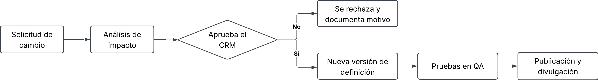
Cualquier cambio en la definición de "cliente activo", en las reglas de calidad o en los atributos del cliente debe funciona a través de este flujo. Asimismo, El análisis de impacto identifica qué modelos, dashboards y reportes se verían afectados y ningún cambio se aplica directamente en producción.

4. Políticas de acceso y seguridad: Cada rol tiene derecho a acceder exclusivamente a lo que requiere para completar sus tareas. El Director CRM puede consultar los datos y es quien aprueba los cambios. El equipo de calidad de datos puede consultarlos y corregir registros. Los científicos de datos trabajan únicamente con datos anonimizados, y los analistas y dashboards solo reciben datos agregados. Los sistemas de las tiendas y el e-commerce leen el registro maestro mediante la sincronización. Además, los datos personales se cifran tanto en reposo como en tránsito, y en los entornos de DEV y QA solo se usan datos anonimizados o seudonimizados. Solo se tratan datos de clientes que diligenciaron el consentimiento informado.

### 2.4. Simulación de caso

Caso: Los sistemas de las tiendas consideran activo a un cliente que compró en tienda en los últimos 12 meses, mientras que los programas de fidelización consideran activo a quien acumuló o redimió puntos en los últimos 12 meses. Por ejemplo, una cliente aparece en los sistemas de las tiendas con el documento 1.020.304.050 y su última compra fue hace 8 meses, por lo que allí figura como inactiva. En los programas de fidelización aparece con el documento 1020304050 y redimió puntos hace 3 meses, por lo que allí figura como activa. Así, la misma persona es activa para un sistema e inactiva para el otro. Además, como su documento viene con formatos distintos, sin MDM no es posible reconocer que es el mismo cliente. Si el modelo de pronóstico usa una fuente y el dashboard de marketing usa otra, el número de clientes activos no coincide.

Resolución: Inicialmente, al limpiar el documento y dejarlo sin puntos, las dos fuentes se reconocen como la misma cliente y se fusionan en un solo registro con una llave. Luego se aplica la definición oficial aprobada por el Director CRM. Como el cliente compró hace 8 meses, queda como activa. Así, el modelo, dashboard y los reportes leen el estado de la cliente desde el registro maestro y ya no lo calculan a parte. Si se desea que redimir puntos cuente como actividad, debe solicitarlo mediante el flujo de aprobación. Si se aprueba, se crea una nueva versión de la definición sin borrar la anterior.

Impacto: Si la definición cambia sin control, no es posible recrear un modelo antiguo, porque ya no está definido con qué criterio fueron identificados los clientes activos. Con MDM, cada versión de la definición queda registrada con su fecha de vigencia y cada modelo guarda qué versión utilizó. Por lo que permite comparar las diferentes versiones de los modelos de forma justa, partiendo de que la diferencia entre ellos se debe al cambio de definición y no solo al algoritmo.

## Actividad 3: Control de versiones para todo

### 3.1 Estructura de git simulada

```text
dataops-taller2-maria-leyva/
├── README.md
├── .gitignore
├── requirements.txt      
├── pytest.ini
├── Dockerfile             
├── .github/workflows/
│   ├── cd.yml              
├── src/             
│   ├── config.py
│   ├── generar_datos.py
│   ├── validar_datos.py
│   ├── train_model.py
│   ├── validate_model.py
│   └── sql/ventas_semanales.sql
├── notebooks/
│   └── exploracion_ventas.ipynb
├── configs/                
│   ├── modelo.yaml
│   ├── dev.yaml
│   ├── qa.yaml
│   └── prod.yaml
├── pipelines/dags/
│   └── pronostico_ventas_dag.py 
├── infra/terraform/
│   └── main.tf             
├── data/
│   ├── ventas.csv.dvc    
│   └── PROCEDENCIA.md
├── tests/
│   └── test_modelo.py
└── docs/images/        
```
Como definición de pipeline se usa GitHub Actions (`cd.yml`), que cumple el mismo rol que un Jenkinsfile.

### 3.2 Archivo README.md

Qué se versiona:

1. Código: scripts de Python, consultas SQL y notebooks exportados a `.py`, para poder revisar sus cambios línea a línea.
2. Configuraciones: archivos YAML por entorno y `requirements.txt` con versiones fijas, para que todos usen las mismas dependencias.
3. Definiciones de pipeline: el workflow de GitHub Actions y el DAG de Airflow, porque la forma en que se construye y orquesta el modelo también debe poder ser reproducible.
4. Definiciones de infraestructura: los archivos de Terraform, para recrear los entornos de forma idéntica.
5. Procedencia de los datos: los archivos `.dvc` y `PROCEDENCIA.md`.

Qué no se versiona:

1. Datos crudos y procesados (`data/*.csv`): Git no está diseñado para archivos grandes y los datos pueden contener información personal.
2. Modelos entrenados y métricas (`models/`, `metrics/`): se generan en cada ejecución del pipeline y se guardan como artefactos.
3. Secretos y credenciales (`.env`): nunca deben quedar en el historial de Git.
4. Estado de Terraform y entornos virtuales (`.tfstate`, `.venv/`): son locales y pueden contener datos sensibles.

Versionado de la procedencia de los datos: los datos no se guardan en Git, sino que se versiona su procedencia con DVC. Al ejecutar `dvc add data/ventas.csv`, DVC genera el archivo `data/ventas.csv.dvc` con un hash único de esa versión de los datos, mientras el archivo real se guarda en un almacenamiento remoto (en producción, un bucket de S3). Ese archivo `.dvc` sí se versiona en Git, junto con `PROCEDENCIA.md`, que documenta de dónde vienen los datos, cómo se extrajeron, en qué fecha y con qué versión de la definición de cliente activo. Así, para recrear un modelo antiguo se debe volver al commit correspondiente (`git checkout`) y recuperar exactamente los mismos datos (`dvc pull`).

### 3.3 Simulación commit y pull request

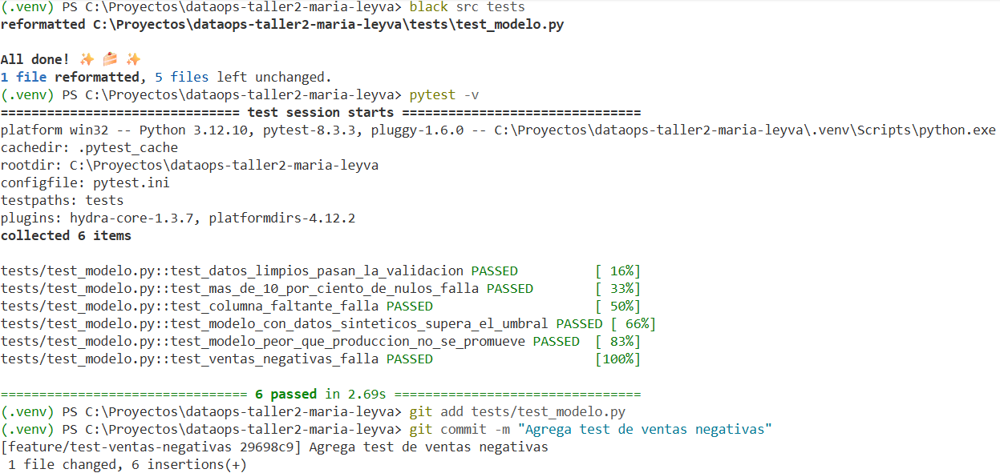

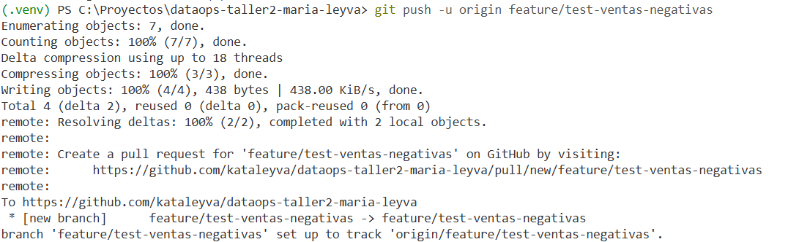

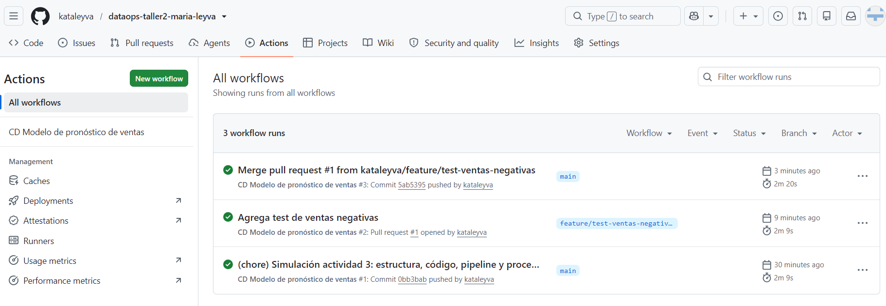

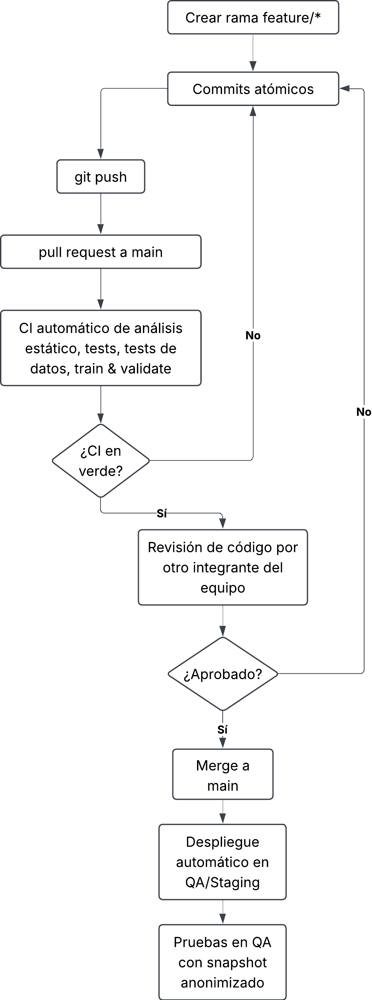

Se creó la rama `feature/test-ventas-negativas` para agregar una prueba nueva. Después de hacer commit y push, se abrió un pull request hacia `main`, que disparó automáticamente el pipeline de CI: análisis estático, pruebas unitarias, test de datos y Train & Validate. Con el pipeline en verde, el cambio pasó a revisión de código, donde un otra persona del equipo revisa que el cambio sea válido, tenga pruebas y no rompa nada. Si el revisor solicita cambios, se corrigen en la misma rama con un nuevo commit y el pipeline se ejecuta de nuevo. Una vez aprobado, se hace merge a `main`, lo que despliega automáticamente la nueva versión en QA/Staging para las pruebas con el snapshot anonimizado. Ningún cambio llega a `main` ni a QA sin pasar por el pipeline y la revisión.

## Actividad 4: Infraestructura como Código (IaC)

### 4.1 Archivo Terraform

Archivo: ```infra/terraform/main.tf```

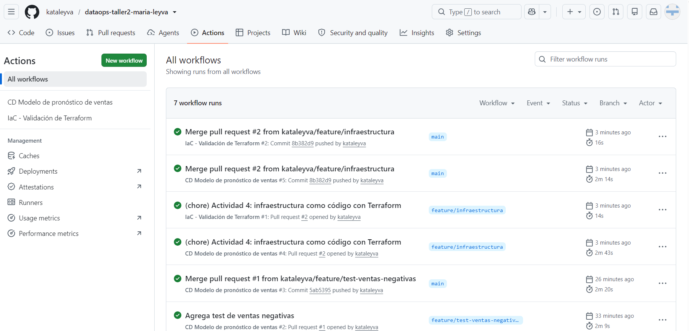

El archivo `infra/terraform/main.tf` define:

1. Un bucket S3 para los datos de staging, privado (sin acceso público) y cifrado.
2. Una instancia EC2 `t3.medium` para DEV, con un perfil que le asigna el rol de desarrollo.
3. Una base de datos RDS PostgreSQL para PROD, con alta disponibilidad (Multi-AZ), cifrado, respaldos de 7 días, protección contra borrado y sin acceso público. La contraseña no está en el código: la genera AWS y la guarda en Secrets Manager.
4. Un rol IAM con permisos restringidos: la instancia de DEV solo puede leer las muestras anonimizadas del bucket de staging, sin permisos de escritura ni acceso a producción.

### 4.2. Replicación de entornos:

El archivo describe la infraestructura de forma declarativa, indicando qué recursos deben existir y con qué configuración, no los pasos manuales para crearlos. Terraform compara esa descripción con lo que existe en la nube y crea o modifica solo lo necesario. Por lo que al ejecutar el mismo archivo siempre produce la misma infraestructura. Además, debido a las variables como proyecto o región el mismo código puede crear una copia idéntica en otra región o con otro prefijo. Como el archivo está en Git, cada cambio de infraestructura queda versionado, revisado y se puede revertir.

Comandos que se aplicarían para aplicar cambios:
1. `terraform init`: descarga el proveedor de AWS e inicializa el proyecto.
2. `terraform fmt`: da formato al código.
3. `terraform validate`: verifica que la sintaxis y la configuración sean válidas.
4. `terraform plan`: muestra qué recursos se van a crear, modificar o eliminar.
5. `terraform apply`: aplica los cambios en la nube tras confirmar el plan.
6. `terraform destroy`: elimina los recursos (por ejemplo, entornos de DEV temporales).

### 4.3 Flujo de trabajo

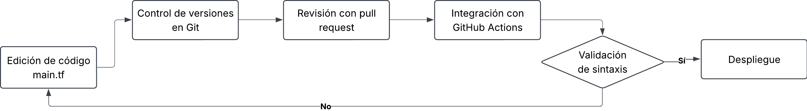

## Actividad 5: Continuous para DataOps

### 5.1 Pipeline CD

El pipeline está definido en `.github/workflows/cd.yml` y y se ejecuta en cada pull request y en cada push a `main`. Tiene seis etapas, donde cada una se ejecuta si la anterior fue no fallo:

1. Build & Test: instalación las dependencias, ejecuta análisis estático y las pruebas unitarias.
2. Test de datos: validación esquema, porcentaje de nulos y que no haya ventas negativas.
3. Train & Validate: entrenamiento del modelo de regresión lineal y comparación de su MAPE contra el umbral y contra el modelo en producción.
4. Empaquetado: construcción de una imagen Docker con el modelo, etiquetada con el commit.
5. Despliegue en Staging: despliegue de la imagen en el entorno de QA.
6. Despliegue en Producción: despliegue de Canary al 10 % del tráfico, con aprobación previa.

### 5.2 Definiciones

1. Build & Test:
   - Herramientas: GitHub Actions, black, pylint, bandit y pytest.
   - Criterio de éxito: código con formato correcto, puntaje de pylint mayor o igual a 8, sin vulnerabilidades medias o altas y el 100 % de las pruebas en verde.
   - Acción en caso de fallo: se detiene el pipeline y el encargado corrige en su rama.

2. Test de datos:
   - Herramientas: Python y pandas o Great Expectations.
   - Criterio de éxito: esquema completo, nulos menores o iguales al 10 % por columna y sin ventas negativas.
   - Acción en caso de fallo: se detiene el pipeline, el modelo no se entrena, se notifica al responsable.

3. Train & Validate:
   - Herramientas: scikit-learn y MLflow.
   - Criterio de éxito: MAPE menor o igual al 15 % y no mayor que el del modelo en producción.
   - Acción en caso de fallo: no se empaqueta el modelo y se abre una incidencia con las métricas, el commit y la versión de los datos.

4. Empaquetado:
   - Herramientas: Docker.
   - Criterio de éxito: la imagen se construye y carga el modelo correctamente.
   - Acción en caso de fallo: se revisa el Dockerfile o las dependencias.

5. Despliegue en Staging:
   - Herramientas: GitHub Environments y Terraform.
   - Criterio de éxito: despliegue con éxito y pruebas de integración y carga en verde.
   - Acción en caso de fallo: no se promueve a producción.

6. Despliegue en Producción:
   - Herramientas: GitHub Environments (aprobación) y estrategia Canary.
   - Criterio de éxito: aprobación del líder técnico y métricas estables durante 24 horas con el 10 % del tráfico.
   - Acción en caso de fallo: rollback automático a la versión anterior.

### 5.3 Simulación fallo

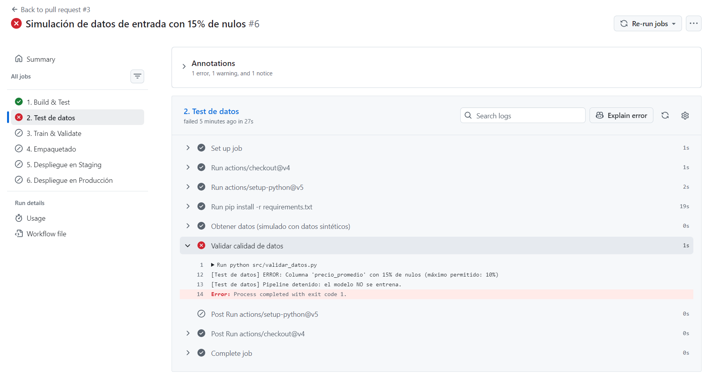

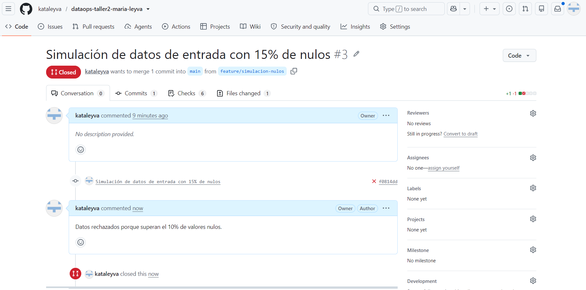

Para simular el fallo, se generaron los datos de entrada con un 15 % de nulos en la columna `precio_promedio`. Al abrir el pull request, la etapa de Test de datos detectó que el porcentaje superaba el máximo permitido del 10 % y terminó con error. Como cada etapa depende de la anterior, Train & Validate, Empaquetado y los despliegues no se ejecutaron, así que el modelo nunca se entrenó con datos defectuosos ni llegó a producción.

Protocolo de actuación:
1. Detección de la etapa de Test de datos para identificar la columna con más del 10 % de nulos y detiene el pipeline.
Herramientas: GitHub Actions, script de validación.
2. Bloqueo para evitar entrenamiento ni empaquetado y no se despliega. Producción sigue con el modelo actual.
Herramientas: dependencias entre etapas (`needs`) y protección de la rama `main`.
3. Notificación de alertas al equipo con el enlace a la ejecución y el error.
Herramientas: notificaciones de GitHub, Slack o correo.
4. Diagnostico para revisar la fuente de los datos para encontrar el origen de los nulos (por ejemplo, una tienda que dejó de reportar precios).
Herramientas: DVC, `PROCEDENCIA.md`.
5. Corrección de la fuente o el proceso de extracción y se vuelven a ejecutar las pruebas.
Herramientas: Git, pipeline de CD.
6. Cierre del pull request no se fusiona hasta que el Test de datos pase.
Herramientas: GitHub Pull Requests.

### 5.4 Diagrama del pipeline

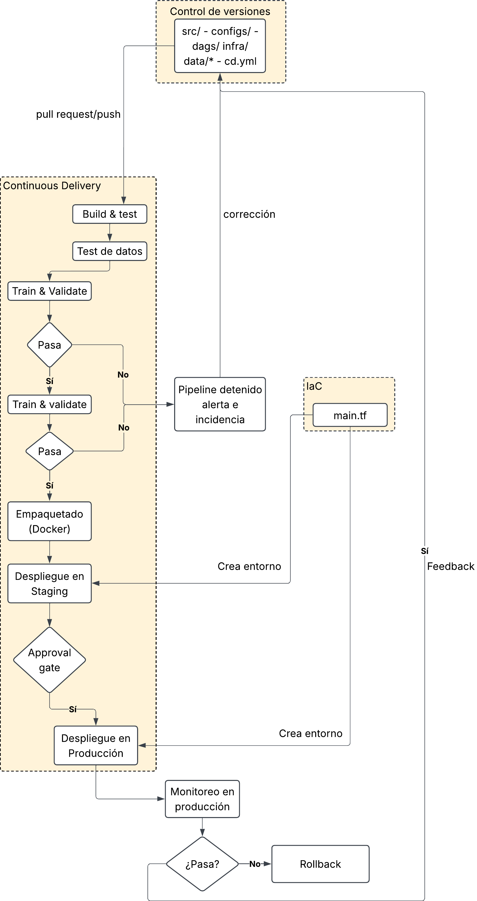

El diagrama está compuesto por los tres pilares. El control de versiones contiene todo lo necesario para reproducir el modelo (código, configuraciones, pipelines, infraestructura y procedencia de datos). La entrega continua automatiza el recorrido desde el pull request hasta producción con filtros de calidad en cada etapa. La infraestructura como código crea los entornos de Staging y Producción con los mismos módulos, para que lo probado en uno se comporte igual en el otro.

## Actividad 6: Integración final

### 6.1 Elaboración de plan

| Fase | Tiempo (semanas) | Componente | Entregable |
|---|---|---|---|
| Preparación | 1–2 | Gobierno | Comité de datos conformado, responsables por entidad definidos y acceso directo del equipo de datos a producción retirado |
| Control de versiones | 2–4 | Git y DVC | Repositorio con estructura estándar, ramas protegidas, revisión obligatoria de pull requests y procedencia de datos con DVC |
| Entornos aislados | 3–6 | DEV, QA y PROD con IaC | Entornos creados con Terraform, datos anonimizados en DEV y QA, y acceso restringido en PROD |
| MDM | 5–10 | Registro maestro | Registro maestro de Cliente y Producto, Proveedor, Ubicación y Finanzas, con reglas de calidad y flujo de aprobación |
| Continuous Delivery | 7–12 | Pipeline de CD | Pipeline con Test de datos, Train & Validate, empaquetado, despliegue en Staging y Producción con approval gate |
| Operación y mejora | 13–16 | Monitoreo | Monitoreo de modelos y datos en producción, rollback automático, métricas de éxito y retrospectiva |

Las fases se superponen, mientras se construye el MDM, el equipo ya trabaja con control de versiones y entornos aislados. Se empieza por el gobierno y el control de versiones porque son la base de todo lo demás.

### 6.2 Definicón métricas

| Componente | Métrica |
|---|---|
| Entornos aislados | Incidentes en producción causados por cambios del equipo de datos |
| Entornos aislados | Porcentaje de cambios que pasan por QA antes de producción |
| MDM | Porcentaje de clientes duplicados |
| MDM | Discrepancias entre dashboards en el número de clientes activos |
| Control de versiones | Porcentaje de modelos replicables |
| IaC | Tiempo de onboarding de un nuevo científico de datos |
| IaC | Tiempo para crear un entorno nuevo |
| Continuous Delivery | Frecuencia de despliegue de modelos |
| Continuous Delivery | Tiempo de recuperación ante fallos |
| Continuous Delivery | Porcentaje de despliegues que fallan en producción |

### 6.3 Informe

### 6.4 Diagrama final
